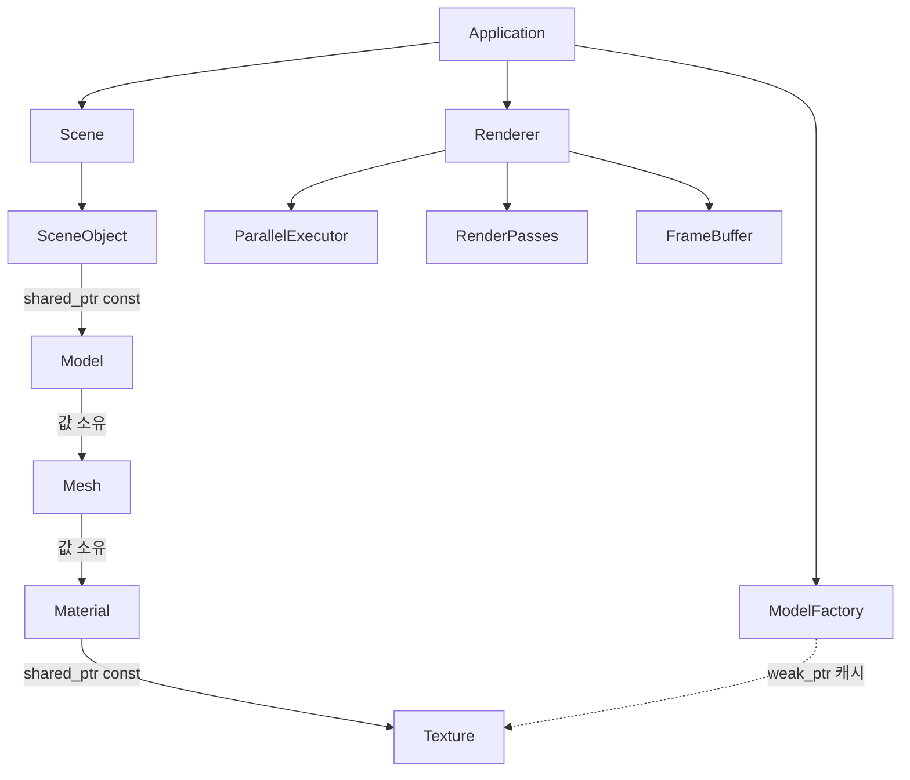

# 구조를 이해하기 위한 학습 안내

이 프로젝트는 CPU에서 정점 변환, 클리핑, 래스터화, 그림자, 조명, 후처리를 수행한다.
구조를 읽을 때는 클래스의 개수보다 **어떤 값들이 함께 유효해야 하는지, 누가 그 수명을 책임지는지**를 먼저 살펴보면 좋다.
아래 개념들을 공부한 뒤 연결된 코드를 읽으면, 각 경계를 둔 이유를 구체적으로 확인할 수 있다.

## 1. 소유권과 관찰 — 누가 무엇을 살아 있게 하는가

[Application](../app/Application.hpp)은 실행 상태, 입력, 창, 리소스 팩토리, 씬과 렌더러를 소유한다.
렌더러를 호출하는 데 창은 필요하지 않으므로 같은 씬을 창에 표시하거나 headless 이미지로 저장할 수 있다.



[SceneObject](../scene/SceneObject.hpp)는 모델의 수명을 공유하지만, 위치와 가시성은 자신의 상태로 가진다.
따라서 바닥과 벽이 같은 [Model](../scene/Model.hpp)을 사용해도 서로 다른 변환을 가질 수 있다.
[Material](../graphics/Material.hpp)은 텍스처를 `shared_ptr<const Texture>`로 참조한다.
[ModelFactory](../resources/ModelFactory.hpp)의 약한 참조 캐시는 모델이 더 이상 사용하지 않는 텍스처를 혼자 붙잡지 않는다.

반면 패스가 받는 `const Scene&`, `const Camera&`와 픽셀의 `span`은 대상을 소유하지 않는다.
**소유권을 연장하는 참조와 잠깐 관찰하는 참조의 차이**를 공부하면 포인터 종류를 선택한 이유가 보인다.
`Scene::Add()`가 돌려주는 인덱스 핸들은 이후 객체를 추가해도 유지되지만, `Get()`으로 얻은 참조나 `GetObjects()`의 span은 추가 시 벡터 재할당으로 무효화될 수 있다.

읽으며 생각할 질문: 같은 모델을 두 번 배치할 때 공유할 것은 정점인가, 모델 행렬인가, 아니면 둘 다인가?

## 2. 불변식과 파생 데이터 — 정상 상태를 누가 보장하는가

**캡슐화, 불변식, 강한 예외 보장**을 공부하면 다음 API들이 한 묶음으로 유지하는 값이 보인다.

| 경계 | 함께 유효해야 하는 값 | 확인할 코드 |
| --- | --- | --- |
| Mesh 생성 | 정점 속성의 유한성, 삼각형 인덱스 범위, 재질 설정, 로컬 경계구 | [Mesh.cpp](../graphics/Mesh.cpp) |
| Model 생성 | 비어 있지 않은 메시 집합과 전체 로컬 경계구 | [Model.cpp](../scene/Model.cpp) |
| SceneObject 변환 | 유한한 가역 affine 변환, normal 변환, 월드 경계구 | [SceneObject.cpp](../scene/SceneObject.cpp) |
| Camera 갱신 | 투영/역투영/뷰 행렬과 그에 대응하는 frustum | [Camera.hpp](../graphics/Camera.hpp) |
| FrameBuffer 크기 변경 | 폭·높이와 color/depth/normal 배열의 동일한 크기 | [FrameBuffer.hpp](../graphics/FrameBuffer.hpp) |

씬에 등록하기 전에 `Create()`와 `CalculateBounds()`를 특정 순서로 호출하는 절차는 없다.
모델의 로컬 경계구는 생성 중 계산되며 읽기만 가능하다.
변환이 바뀌면 `SetTransform()`이 normal 행렬과 월드 경계구까지 계산한 뒤 함께 반영한다.
실패한 변환은 이전의 정상 상태를 보존한다.

월드 경계구는 행렬 열의 길이 중 최댓값만 사용하지 않는다.
선형 부분을 A라고 할 때 `||A||₂² ≤ ||AᵀA||∞`라는 상한을 이용하므로 shear에서도 객체를 실제보다 작게 감싸지 않는다.
**행렬의 연산자 norm과 보수적인 공간 경계**를 공부하면, 회전·확대만 시험하는 것과 shear까지 시험하는 것의 차이가 보인다.

읽으며 생각할 질문: 정점이 바뀔 때와 모델 행렬만 바뀔 때, 무효가 되는 값은 각각 무엇인가?

## 3. 생성과 사용의 분리 — 파일 이름이 객체의 종류인가

**SRP의 변경 이유, 데이터와 행동의 차이, 합성과 상속**을 공부할 지점이다.

[ObjLoader](../resources/ObjLoader.hpp)는 파일 문법을 해석하고 정점·인덱스를 만든다.
음수 인덱스, convex polygon의 fan 삼각분할, smoothing group과 생략된 normal을 처리한다.
UV가 퇴화한 경우에는 0으로 나눠 잘못된 tangent를 만드는 대신 normal에 수직인 유한 tangent를 만든다.
잘못된 인덱스나 파일 형식은 원점 정점으로 대체하지 않고 파일 이름과 줄 번호를 포함한 오류로 보고한다.

[ModelFactory](../resources/ModelFactory.cpp)는 어떤 OBJ와 텍스처가 하나의 모델을 구성하는지 결정한다.
`Diablo`, `African`, `Plane`이라는 파생 클래스가 없어도 렌더링 중에는 동일한 Model/SceneObject 계약으로 동작한다.
반복 로딩의 텍스처 캐시도 이 생성 경계에 있다.

[Texture](../graphics/Texture.hpp)는 정상적인 RGBA 이미지로 생성된 이후 읽기만 제공한다.
디코더 구현은 [Texture.cpp](../graphics/Texture.cpp) 한 번역 단위에만 존재하며, 임시 디코딩 메모리는 RAII로 해제한다.
이미지 뒤집기는 자신의 복사본에서 수행하므로 stb의 전역 로딩 옵션을 바꾸지 않는다.

읽으며 생각할 질문: 다른 OBJ 파일을 사용한다는 사실은 새로운 실행 중 행동인가, 같은 행동에 전달할 데이터인가?

## 4. 합성과 정적 다형성 — 셰이더가 지켜야 하는 약속

[Rasterizer](../graphics/Rasterizer.hpp)는 특정 재질의 멤버 이름이나 애플리케이션 설정을 알지 않는다.
템플릿 인자로 받는 셰이더는 다음 연산을 제공한다.

```cpp
shader::Varyings Process(const graphics::Vertex&) const;
shader::FragmentOutput Shade(const shader::Fragment&) const;
```

Model, Toon, Shadow 셰이더는 [DrawUniforms](../shaders/Elements.hpp), 재질, 필요할 때의 그림자 맵을 조합한다.
공통 부모 클래스의 virtual 호출 대신 이 연산들의 존재를 컴파일 시점에 확인한다.
`FragmentOutput`은 최종 픽셀 색과 view-space normal을 함께 반환하므로 래스터라이저가 셰이더 내부의 `Uniform.View`를 꺼내 볼 필요가 없다.

불투명 그림자는 `OpaqueShadow::DepthOnly = true`로 깊이만 쓰는 계약을 선언한다.
이 경우에는 표면 계산이나 속성 보간이 필요하지 않으므로 래스터라이저가 해당 코드를 컴파일 시점에 생략한다.
알파 마스크·반투명 그림자는 기존 셰이더 경로를 사용한다.
**정적 다형성과 계산에 필요한 최소 데이터**를 함께 공부하면, 정보 은닉을 지키면서 계산량도 줄이는 방법을 볼 수 있다.

**정적 다형성, 인터페이스의 최소 계약, 정보 은닉**을 공부하면 구현을 공유하는 방법과 사용 계약을 공유하는 방법이 서로 다르다는 점이 보인다.
버텍스 데이터는 [graphics::Vertex](../graphics/Vertex.hpp)에 있고 `shader::Vertex`는 같은 타입의 별칭이다.
리소스 로더가 셰이더 구현에 의존하지 않는 이유도 함께 살펴볼 수 있다.

## 5. 좌표계와 수치의 의미 — 같은 float에도 서로 다른 단위가 있다

현재 렌더링 경로의 좌표 규약은 다음과 같다.

| 데이터 | 의미 |
| --- | --- |
| `Matrix[column][row]` | 열 우선 저장, `Matrix * Vector`의 열벡터 연산 |
| 모델 정점 | 위치 W=1, 방향 W=0 |
| view 공간 | 카메라 앞쪽은 음수 Z |
| homogeneous clip 공간 | `-W ≤ X,Y ≤ W`, `0 ≤ Z ≤ W` |
| 화면 좌표 | 원점은 좌상단, Y는 아래로 증가 |
| depth buffer | NDC Z의 [0,1], clear=1, 가까운 값이 우선 |
| fragment normal | world 공간의 방향 |
| normal attachment | view 공간의 방향 |
| tangent W | 3차원 방향 성분이 아닌 handedness 부호 |
| 텍스처 | RGBA8, 아래쪽 행이 V=0, repeat/nearest sampling |
| framebuffer 색 | 정수 `0xAARRGGBB`, straight alpha |

**동차 좌표 클리핑, 원근 보정 보간, inverse-transpose, tangent space**를 공부한 뒤 [Elements.hpp](../shaders/Elements.hpp)와 래스터라이저의 보간 부분을 읽어 보면 좋다.
클리핑 중에는 속성을 선형 보간하며 normal을 중간에 정규화하지 않는다.
픽셀 속성은 reciprocal W로 원근을 보정하지만, 이미 NDC가 된 Z는 화면에서 선형 보간한다.
normal의 정규화와 tangent frame 재구성은 표면을 평가하는 경계에서 수행한다.

[Color.hpp](../graphics/Color.hpp)는 SIMD lane 순서와 framebuffer의 비트 배치를 구분한다.
Point, wireframe, triangle이 같은 픽셀 형식을 사용하는지 [RasterizerTests](../tests/RasterizerTests.cpp)에서 확인할 수 있다.

## 6. 패스와 동기화 — 빈 작업도 실행 흐름의 일부다

[Renderer::Render](../graphics/Renderer.cpp)의 순서는 다음과 같다.

```text
그림자 → 불투명/마스크 표면 → SSAO → 반투명 표면 → AA → 표시 또는 저장
```

SSAO가 읽는 depth와 normal은 불투명 표면의 자료다.
반투명 색을 섞은 뒤 그 픽셀의 불투명 depth로 AO를 적용하는 의미 혼합을 피하기 위해, 반투명 합성은 SSAO 다음에 수행한다.
Point/wireframe 진단 모드는 표면 G-buffer가 없으므로 SSAO를 실행하지 않는다.

**happens-before, 작업 완료 경계, 참조의 수명**을 공부하면 [ParallelExecutor](../graphics/ParallelExecutor.hpp)의 계약을 이해하기 쉽다.
`ParallelFor()`는 자신의 모든 콜백이 완료된 후 반환하고, 작업 중 발생한 예외도 호출 스레드에 전달한다.
작업이 한 chunk 이하이면 호출 스레드에서 바로 처리한다. 동시에 수행할 일이 없는 상황에서는 worker를 깨워도 병렬성이 생기지 않는다.
래스터라이저와 각 패스도 완료 후 반환하므로 다음 패스가 입력을 읽거나 다음 프레임이 버퍼를 지울 때 이전 쓰기가 남아 있지 않는다.
렌더러는 executor와 작업용 버퍼를 소유하며 작업이 렌더러의 수명을 넘어가지 않는다.

삼각형은 타일별로 픽셀 소유 범위를 나눠 병렬화한다.
겹치는 point와 line은 같은 픽셀의 depth 검사·쓰기를 경쟁시키지 않도록 순차 처리한다.
**병렬화 가능 여부와 SIMD 사용 여부는 별개**라는 점을 이 경계에서 확인할 수 있다.

## 7. 테스트와 현재의 표현 범위

[SceneTests](../tests/SceneTests.cpp)는 정상 생성만 확인하지 않는다.
잘못된 메시·파일·변환의 거부, 실패한 갱신의 이전 상태 보존, shear의 경계구, 비균일 스케일의 normal, 실제 에셋과 텍스처 수명 공유를 검사한다.
이처럼 **불변식과 반례 중심의 테스트**를 공부하면 구현을 그대로 반복하는 테스트와 계약을 확인하는 테스트의 차이가 보인다.

현재 렌더러는 학습용 근사를 포함한다.

- 반투명 메시는 깊이 기준으로 정렬하고 메시 내부 삼각형도 정렬하지만, 서로 교차하는 투명 표면의 정확한 합성까지 보장하지 않는다. 이 영역은 polygon splitting과 order-independent transparency를 공부할 주제다.
- 그림자는 고정 크기의 orthographic 영역과 PCSS 형태의 제한된 샘플 필터를 사용한다. 영역 밖 그림자, 깊이 bias, 부드러움은 shadow-map 해상도·범위·표본화의 영향을 받는다. 반투명 재질도 depth shadow에서는 alpha coverage로 근사하며 색이 있는 투과광을 계산하지 않는다.
- 색상 텍스처는 정규화한 byte 값을 직접 조명 계산에 사용한다. 완전한 linear-light/sRGB 변환이나 물리 기반 재질 모델은 별도의 학습 주제다.
- OBJ의 일반적인 convex face를 지원하며 concave polygon의 정확한 삼각분할과 MTL 재질 해석은 제공하지 않는다. 모델별 재질 연결은 ModelFactory에 명시한다.
- SIMD의 SSE/NEON 경로가 존재하지만 Windows x64/MSVC가 실제 빌드·검증 대상이다. ARM 실행 결과와 성능은 검증되지 않았다.

새 동작을 추가할 때는 우선 그것이 **리소스 생성, 씬 상태, 픽셀 계산, 패스 순서 중 어디의 계약을 바꾸는지** 질문하면 변경이 퍼져야 할 범위를 판단하기 쉽다.

현재 구조에서 프레임 시간을 줄인 과정과 재현 명령은 [성능 측정 안내](PERFORMANCE.md)에 정리했다.
